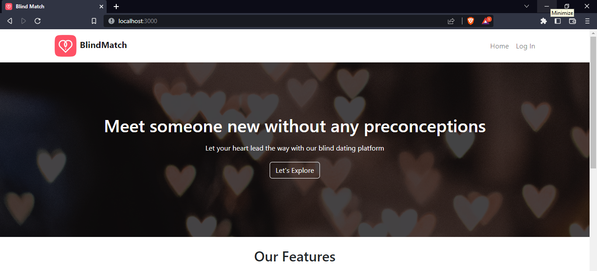
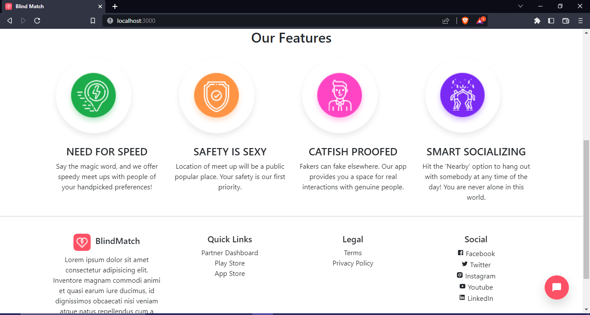
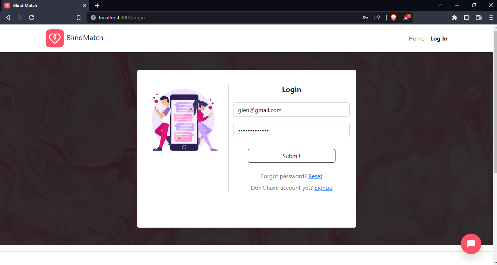
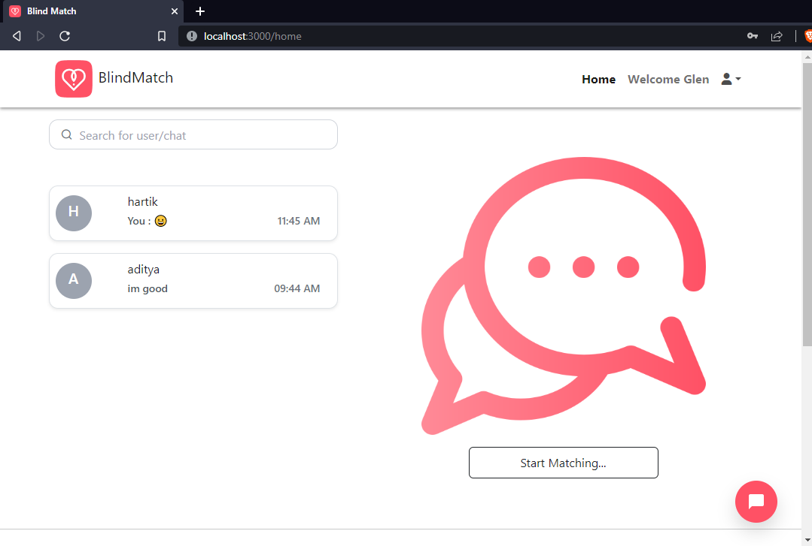
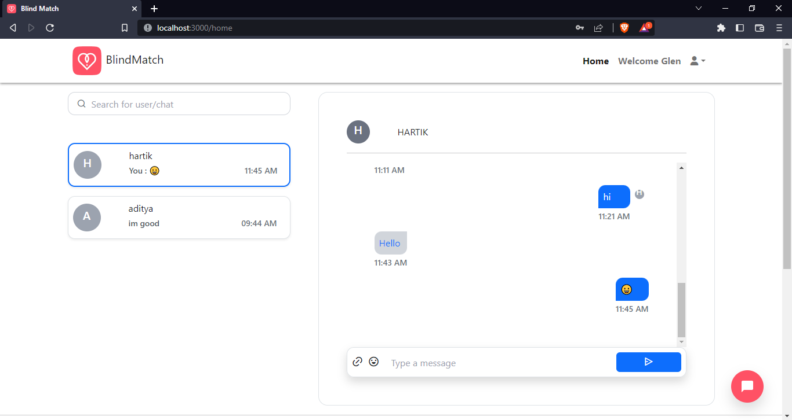
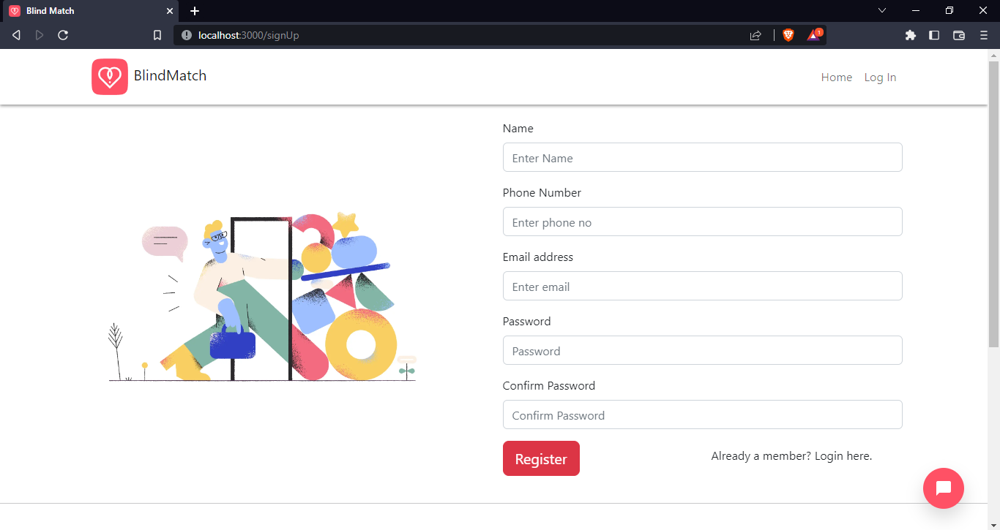
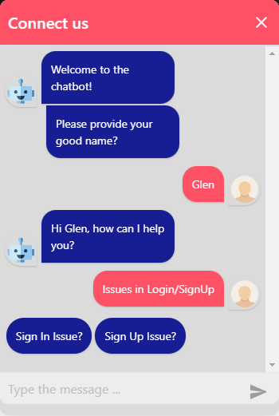
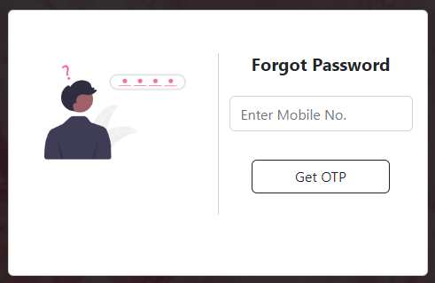

# BlindMatch: Blind Dating Web Application

BlindMatch Web Application aims to create a safe and inclusive platform where individuals can find meaningful connections based on shared values and interests, rather than just physical appearance or initial impressions. 

The web application will also include safety features, such as profile verification and reporting systems, to ensure the safety of all users.

## Problem Definition✨

- 
Traditional dating methods often rely on superficial judgments based on physical appearance or initial impressions, which can be misleading and unfair. 

- 
Additionally, individuals who are shy, introverted, or have social anxiety may find it challenging to approach others or feel comfortable in social situations, which can make it difficult for them to find potential partners.

## Scope & Features 💡

BlindMatch Web application consists of following modules/features:-

- 
 Login Authentication via JWT (jsonwebtoken).

- 
Profile authentication via Mobile OTP verification.

- 
Implemented a Chatbot to help out user with basic queries.

- 
Realtime conversation via Socket IO which includes Read receipts, timestamps, online status, unread messages & emojis.

- 
One-to-One chat Session with another user.

## Screenshots ✨

<table>
    <tr>
        <td></td>
        <td></td>
    </tr>
    <tr>
        <td></td>
         <td></td>
    </tr>
    <tr>
        <td></td>
         <td></td>
    </tr>
    <tr>
        <td></td>
         <td></td>
    </tr>
</table>

 
 

## Tech Stack 👨‍💻

- FrontEnd: ReactJS, Redux, Bootstrap, React-Bootstrap, Tailwind, AntD, AOS, Socket IO Client
- Backend: NodeJS, ExpressJS, Mongoose, JWT, MongoDB, Socket IO, Fast2API